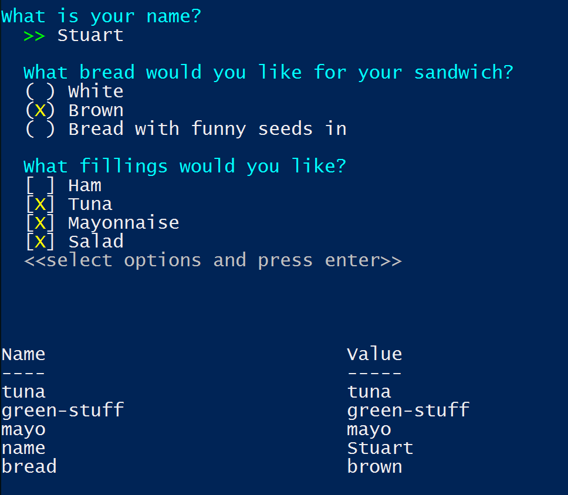

# RiddlerPS
RiddlerPS is a PowerShell module that simplifies user interaction in PowerShell

## Installing RiddlerPS
### PowerShell Gallery
You can install [RiddlerPS](https://www.powershellgallery.com/packages/riddlerps/) via the [PowerShell Gallery](https://www.powershellgallery.com)

```powershell
Install-Module -Name RiddlerPS
```

See https://www.powershellgallery.com/ for enabling `Install-Module` if you haven't got PowerShell 5

### Manual
To manually install, clone or download the repo and run `install.ps1`

## Getting Started

```powershell
$prompts = @(
        (New-PromptObject `
            -name "name" `
            -promptType Question `
            -text "What is your name?"),       
        (New-PromptObject `
            -name "bread" `
            -promptType PickOne `
            -text "`What bread would you like for your sandwich?" `
                -options ([ordered]@{
                    'white'='White'
                    'brown'='Brown'
                    'granary'='Bread with funny seeds in'
                })),      
        (New-PromptObject `
            -name "fillings" `
            -promptType PickMany `
            -text "`What fillings would you like?" `
                -options ([ordered]@{
                    'ham'='Ham'
                    'tuna'='Tuna'
                    'mayo'='Mayonnaise'
                    'green-stuff'='Salad'
                }))           
);
Invoke-Prompts -prompts $prompts
```

The result of this is:




For a fuller example of what RiddlerPS can do, run the show-help.ps1 script from the repo. This will guide you through the capabilities of RiddlerPS.